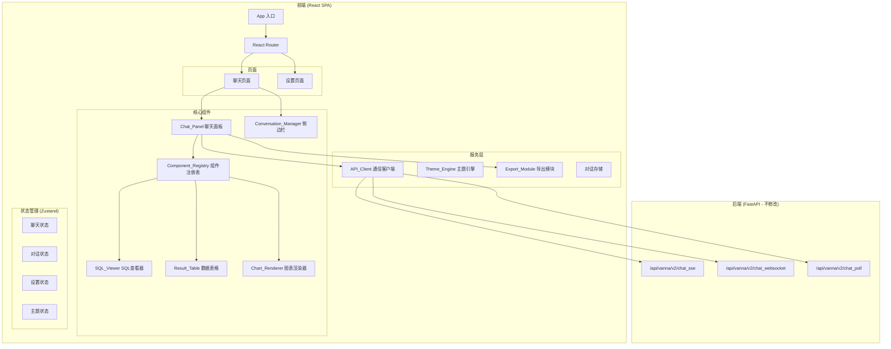
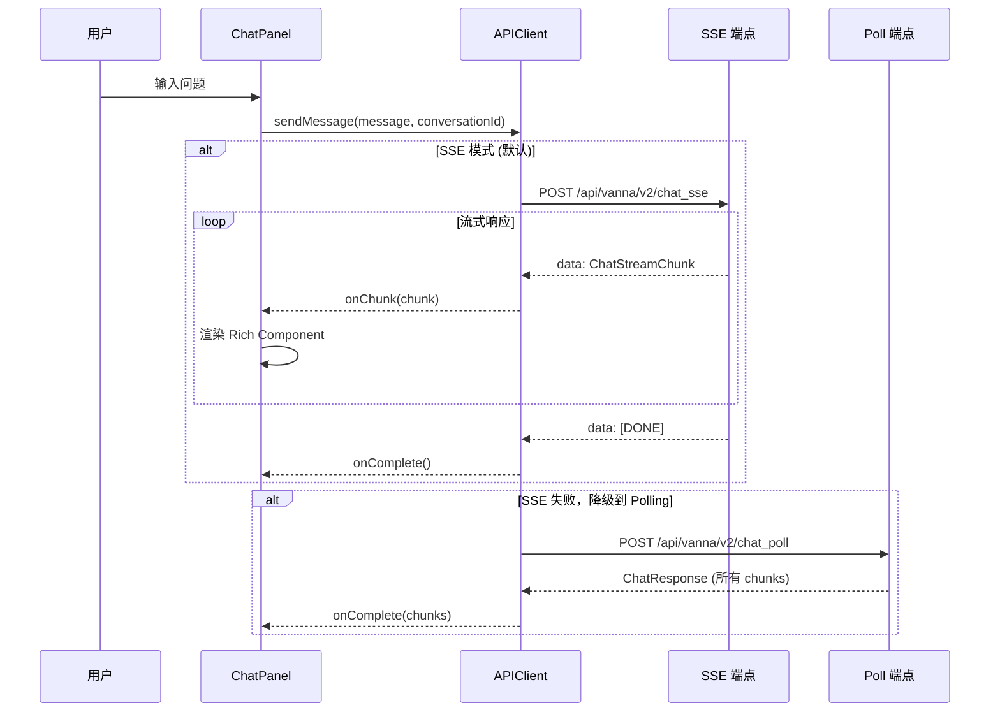

# 设计文档：Vanna UI 重写

## 概述

本设计文档描述 Vanna 项目前端 UI 的完整重写方案。新 UI 将替换现有的基于 Lit Web Component 的聊天界面（`vanna/frontends/webcomponent/` 和 `vanna_components.js`），采用 React + TypeScript 技术栈构建现代化、紧凑的单页应用（SPA）。

**重要边界说明：本次重写仅涉及前端 UI 层，后端 FastAPI 服务及其所有数据查询功能（Vanna Agent、SQL Runner、LLM 服务等）完全保持不变，不做任何修改。** 新 UI 通过现有的三个 API 端点（SSE/WebSocket/Polling）与后端通信，前端仅负责展示和交互。

### 设计决策与理由

1. **技术栈选择：React + TypeScript + Vite**
   - React 生态系统成熟，组件库丰富，社区支持强大
   - TypeScript 提供类型安全，与后端 Pydantic 模型对应
   - Vite 提供极快的开发体验和优化的生产构建
   - 相比现有 Lit Web Component 方案，React 更易于维护和扩展

2. **UI 框架：Ant Design (antd)**
   - 提供完整的企业级组件库，减少自定义组件开发量
   - 内置紧凑主题（compact theme）支持，符合需求中的紧凑设计要求
   - 内置暗色/亮色主题切换
   - 国际化支持良好

3. **图表库：ECharts**
   - 比 Plotly 更轻量，渲染性能更好
   - 丰富的图表类型和交互功能
   - 支持导出为 PNG
   - 中文文档完善

4. **状态管理：Zustand**
   - 轻量级，API 简洁
   - 无需 Provider 包裹，减少组件嵌套
   - 支持 middleware（persist、devtools）

5. **数据导出：SheetJS (xlsx)**
   - 纯前端 Excel 导出，无需后端支持
   - 支持保留数据类型格式

## 架构

### 整体架构图



### 通信架构



### 项目目录结构

```
vanna-ui/
├── index.html
├── package.json
├── tsconfig.json
├── vite.config.ts
├── src/
│   ├── main.tsx                    # 入口文件
│   ├── App.tsx                     # 根组件 + 路由
│   ├── api/
│   │   └── client.ts              # API_Client (SSE/WS/Poll)
│   ├── stores/
│   │   ├── chatStore.ts           # 聊天状态
│   │   ├── conversationStore.ts   # 对话管理状态
│   │   ├── settingsStore.ts       # 设置状态
│   │   └── themeStore.ts          # 主题状态
│   ├── pages/
│   │   ├── ChatPage.tsx           # 聊天主页面
│   │   └── SettingsPage.tsx       # 设置页面
│   ├── components/
│   │   ├── chat/
│   │   │   ├── ChatPanel.tsx      # 聊天面板
│   │   │   ├── MessageBubble.tsx  # 消息气泡
│   │   │   ├── ChatInput.tsx      # 输入框
│   │   │   └── WelcomeGuide.tsx   # 欢迎引导
│   │   ├── sidebar/
│   │   │   └── ConversationSidebar.tsx  # 对话侧边栏
│   │   ├── rich/
│   │   │   ├── ComponentRegistry.tsx    # 组件注册表
│   │   │   ├── SQLViewer.tsx            # SQL 查看器
│   │   │   ├── ResultTable.tsx          # 数据表格
│   │   │   ├── ChartRenderer.tsx        # 图表渲染器
│   │   │   ├── CardComponent.tsx        # 卡片组件
│   │   │   ├── ProgressBar.tsx          # 进度条
│   │   │   ├── NotificationComponent.tsx # 通知组件
│   │   │   ├── LogViewer.tsx            # 日志查看器
│   │   │   ├── BadgeComponent.tsx       # 徽章组件
│   │   │   ├── ButtonComponent.tsx      # 按钮组件
│   │   │   ├── ArtifactComponent.tsx    # 制品组件
│   │   │   ├── TextComponent.tsx        # 文本/Markdown 组件
│   │   │   └── FallbackComponent.tsx    # 未知组件兜底
│   │   └── settings/
│   │       ├── DatabaseConfig.tsx       # 数据库配置
│   │       ├── LLMConfig.tsx            # LLM 配置
│   │       └── UIPreferences.tsx        # UI 偏好
│   ├── utils/
│   │   ├── export.ts              # 导出工具 (CSV/Excel)
│   │   └── format.ts             # 数据格式化工具
│   └── types/
│       └── index.ts               # TypeScript 类型定义
```

## 组件与接口

### 1. API_Client (`api/client.ts`)

负责与 FastAPI 后端通信，支持 SSE、WebSocket 和 Polling 三种模式。

```typescript
interface ChatRequest {
  message: string;
  conversation_id?: string;
  request_id?: string;
  metadata?: Record<string, any>;
}

interface ChatStreamChunk {
  rich: RichComponentData;
  simple?: SimpleComponentData | null;
  conversation_id: string;
  request_id: string;
  timestamp: number;
}

interface ChatResponse {
  chunks: ChatStreamChunk[];
  conversation_id: string;
  request_id: string;
  total_chunks: number;
}

type TransportMode = 'sse' | 'websocket' | 'poll';

interface APIClientConfig {
  sseEndpoint: string;    // 默认: /api/vanna/v2/chat_sse
  wsEndpoint: string;     // 默认: /api/vanna/v2/chat_websocket
  pollEndpoint: string;   // 默认: /api/vanna/v2/chat_poll
  preferredMode: TransportMode;  // 默认: 'sse'
  autoFallback: boolean;  // 默认: true, SSE 失败自动降级到 poll
}

class APIClient {
  constructor(config: APIClientConfig);
  
  // SSE 流式通信
  async sendSSE(
    request: ChatRequest,
    onChunk: (chunk: ChatStreamChunk) => void,
    onDone: () => void,
    onError: (error: Error) => void
  ): Promise<void>;
  
  // WebSocket 通信
  connectWebSocket(): Promise<void>;
  sendWebSocket(request: ChatRequest): void;
  onWebSocketMessage(handler: (chunk: ChatStreamChunk) => void): void;
  disconnectWebSocket(): void;
  
  // Polling 通信
  async sendPoll(request: ChatRequest): Promise<ChatResponse>;
  
  // 统一发送接口（自动选择传输模式）
  async sendMessage(
    request: ChatRequest,
    onChunk: (chunk: ChatStreamChunk) => void,
    onDone: () => void,
    onError: (error: Error) => void
  ): Promise<void>;
}
```

### 2. Component_Registry (`components/rich/ComponentRegistry.tsx`)

将后端返回的 Rich Component 数据映射到对应的 React 组件进行渲染。

```typescript
interface RichComponentData {
  id: string;
  type: string;           // ComponentType 枚举值
  lifecycle: string;      // 'create' | 'update' | 'replace' | 'remove'
  data: Record<string, any>;
  children: string[];
  timestamp: string;
  visible: boolean;
  interactive: boolean;
}

// 组件渲染器类型
type ComponentRenderer = React.FC<{ data: RichComponentData }>;

// 注册表
const componentMap: Record<string, ComponentRenderer> = {
  'text': TextComponent,
  'dataframe': ResultTable,
  'chart': ChartRenderer,
  'card': CardComponent,
  'progress_bar': ProgressBar,
  'progress_display': ProgressDisplay,
  'notification': NotificationComponent,
  'log_viewer': LogViewer,
  'badge': BadgeComponent,
  'icon_text': IconTextComponent,
  'status_indicator': StatusIndicator,
  'button': ButtonComponent,
  'button_group': ButtonGroupComponent,
  'artifact': ArtifactComponent,
  'code_block': SQLViewer,
};

// 渲染入口
function RichComponentRenderer({ component }: { component: RichComponentData }): JSX.Element;
```

### 3. ChatPanel (`components/chat/ChatPanel.tsx`)

```typescript
interface Message {
  id: string;
  role: 'user' | 'assistant';
  content?: string;
  components: RichComponentData[];  // AI 回复中的 Rich Components
  timestamp: number;
  status: 'sending' | 'streaming' | 'done' | 'error';
  error?: string;
}

interface ChatPanelProps {
  conversationId: string;
  messages: Message[];
  isLoading: boolean;
  onSendMessage: (message: string) => void;
  onRetry: (messageId: string) => void;
}
```

### 4. SQL_Viewer (`components/rich/SQLViewer.tsx`)

```typescript
interface SQLViewerProps {
  data: RichComponentData;  // type='code_block', data 包含 sql 内容
}
// 功能：
// - SQL 语法高亮 (使用 Prism.js 或 highlight.js)
// - 一键复制到剪贴板
// - 可折叠面板，超过 10 行自动折叠
// - 紧凑的嵌入式设计
```

### 5. Result_Table (`components/rich/ResultTable.tsx`)

```typescript
interface ResultTableProps {
  data: RichComponentData;  // type='dataframe'
  // data.data 包含: columns, data (rows), title, searchable, sortable, exportable 等
}
// 功能：
// - 按列排序（升序/降序）
// - 关键字搜索过滤
// - 超过 50 行使用虚拟滚动 (react-window)
// - 数据类型自动对齐和格式化
// - CSV 导出快捷按钮
```

### 6. Chart_Renderer (`components/rich/ChartRenderer.tsx`)

```typescript
interface ChartRendererProps {
  data: RichComponentData;  // type='chart'
  // data.data 包含: chart_type, data, title, config 等
}
// 功能：
// - 支持 bar, line, pie, scatter 图表类型
// - 悬停数据提示框 (tooltip)
// - 导出为 PNG
// - 紧凑卡片嵌入
```

### 7. Export_Module (`utils/export.ts`)

```typescript
interface ExportOptions {
  filename?: string;       // 自动生成含时间戳的文件名
  format: 'csv' | 'xlsx';
  preserveTypes?: boolean; // Excel 导出时保留数据类型
}

function exportToCSV(columns: string[], rows: Record<string, any>[], options?: ExportOptions): void;
function exportToExcel(columns: string[], rows: Record<string, any>[], columnTypes?: Record<string, string>, options?: ExportOptions): void;
function generateFilename(prefix?: string): string;  // 生成含时间戳的文件名
```

### 8. Conversation_Manager (`stores/conversationStore.ts`)

```typescript
interface Conversation {
  id: string;
  title: string;          // 自动从第一条消息生成
  messages: Message[];
  createdAt: number;
  updatedAt: number;
}

interface ConversationStore {
  conversations: Conversation[];
  activeConversationId: string | null;
  
  createConversation: () => string;
  deleteConversation: (id: string) => void;
  switchConversation: (id: string) => void;
  addMessage: (conversationId: string, message: Message) => void;
  updateMessage: (conversationId: string, messageId: string, updates: Partial<Message>) => void;
  generateTitle: (conversationId: string) => void;
}
```

### 9. Settings_Page (`pages/SettingsPage.tsx`)

> **注意：** 由于本次重写不修改后端，设置页面目前仅作为前端 UI 配置界面。数据库连接和 LLM 配置信息存储在 localStorage 中供展示和参考，实际的后端配置仍需通过修改 `run_vanna.py` 来完成。未来如果后端新增设置 API，可以无缝对接。UI 偏好设置（主题、语言）则完全在前端生效。

```typescript
interface DatabaseConfig {
  server: string;
  database: string;
  authType: 'windows' | 'sql';
  username?: string;
  password?: string;
  driver: string;
}

interface LLMConfig {
  model: string;
  apiKey: string;
  baseUrl: string;
}

interface UIPreferences {
  theme: 'light' | 'dark';
  language: 'zh-CN' | 'en-US';
}

interface SettingsStore {
  database: DatabaseConfig;
  llm: LLMConfig;
  ui: UIPreferences;
  
  updateDatabase: (config: Partial<DatabaseConfig>) => void;
  updateLLM: (config: Partial<LLMConfig>) => void;
  updateUI: (prefs: Partial<UIPreferences>) => void;
  testConnection: () => Promise<{ success: boolean; error?: string }>;  // 预留接口，待后端支持
  saveSettings: () => Promise<void>;  // 当前保存到 localStorage
  validateSettings: () => { valid: boolean; errors: Record<string, string> };
}
```

### 10. Theme_Engine (`stores/themeStore.ts`)

```typescript
interface ThemeStore {
  mode: 'light' | 'dark';
  toggle: () => void;
  setMode: (mode: 'light' | 'dark') => void;
}
// 使用 Ant Design ConfigProvider 的 theme 属性切换主题
// 使用 localStorage 持久化主题偏好
// 紧凑主题通过 antd 的 theme.algorithm 配置：
//   theme={{ algorithm: [theme.compactAlgorithm, theme.darkAlgorithm] }}
```

## 数据模型

### Rich Component 数据模型（与后端对应）

后端 `RichComponent` 通过 `serialize_for_frontend()` 序列化后，前端接收的 JSON 结构如下：

```typescript
// 基础组件结构
interface RichComponentData {
  id: string;
  type: ComponentType;
  lifecycle: 'create' | 'update' | 'replace' | 'remove';
  data: Record<string, any>;  // 组件特定数据
  children: string[];
  timestamp: string;
  visible: boolean;
  interactive: boolean;
}

// 组件类型枚举（与后端 ComponentType 对应）
type ComponentType =
  | 'text'
  | 'card'
  | 'container'
  | 'status_card'
  | 'progress_display'
  | 'log_viewer'
  | 'badge'
  | 'icon_text'
  | 'task_list'
  | 'progress_bar'
  | 'button'
  | 'button_group'
  | 'table'
  | 'dataframe'
  | 'chart'
  | 'code_block'
  | 'status_indicator'
  | 'notification'
  | 'alert'
  | 'artifact'
  | 'status_bar_update'
  | 'task_tracker_update'
  | 'chat_input_update';

// DataFrameComponent 数据
interface DataFrameData {
  data: Record<string, any>[];   // 行数据
  columns: string[];
  title?: string;
  description?: string;
  row_count: number;
  column_count: number;
  searchable: boolean;
  sortable: boolean;
  exportable: boolean;
  column_types: Record<string, string>;
  page_size: number;
}

// ChartComponent 数据
interface ChartData {
  chart_type: string;   // 'line' | 'bar' | 'pie' | 'scatter'
  data: Record<string, any>;
  title?: string;
  width?: string | number;
  height?: string | number;
  config: Record<string, any>;
}

// ArtifactComponent 数据
interface ArtifactData {
  artifact_type: string;
  content: string;
  title?: string;
  language?: string;
  metadata: Record<string, any>;
}

// ButtonComponent 数据
interface ButtonData {
  label: string;
  action: string;
  variant?: string;
  disabled?: boolean;
  icon?: string;
}

// ComponentUpdate 数据（增量更新）
interface ComponentUpdateData {
  type: 'component_update';
  data: {
    operation: 'create' | 'update' | 'replace' | 'remove';
    component_id: string;
    component?: RichComponentData;
  };
}
```

### 对话数据模型

```typescript
interface Conversation {
  id: string;
  title: string;
  messages: Message[];
  createdAt: number;
  updatedAt: number;
}

interface Message {
  id: string;
  role: 'user' | 'assistant';
  content?: string;           // 用户消息文本
  components: RichComponentData[];  // AI 回复的组件列表
  timestamp: number;
  status: 'sending' | 'streaming' | 'done' | 'error';
  error?: string;
}
```

### 设置数据模型

```typescript
interface AppSettings {
  database: {
    server: string;
    database: string;
    authType: 'windows' | 'sql';
    username?: string;
    password?: string;
    driver: string;
  };
  llm: {
    model: string;
    apiKey: string;
    baseUrl: string;
  };
  ui: {
    theme: 'light' | 'dark';
    language: 'zh-CN' | 'en-US';
  };
}
```

## 正确性属性 (Correctness Properties)

*属性（Property）是指在系统所有有效执行中都应保持为真的特征或行为——本质上是关于系统应该做什么的形式化声明。属性是人类可读规范与机器可验证正确性保证之间的桥梁。*

### Property 1: 流式消息追加

*For any* 消息列表和任意有效的 ChatStreamChunk 序列，每个 chunk 到达时都应被追加到当前消息的 components 数组中，且追加后 components 的长度应增加 1。

**Validates: Requirements 1.2**

### Property 2: 错误消息保留

*For any* 后端返回的错误响应，消息状态应被设置为 'error'，且错误详情字符串应被完整保留在 message.error 字段中，不为空。

**Validates: Requirements 1.5**

### Property 3: ChatRequest 序列化完整性

*For any* 用户消息字符串和可选的 conversation_id，序列化后的 ChatRequest JSON 应包含 message、conversation_id、request_id 和 metadata 四个字段，且 message 字段值与输入一致。

**Validates: Requirements 2.4**

### Property 4: ChatStreamChunk 解析往返

*For any* 有效的 ChatStreamChunk JSON 对象，解析后应正确提取 rich 字段（非空对象）、可选的 simple 字段、conversation_id 和 request_id，且重新序列化后应与原始数据等价。

**Validates: Requirements 2.5, 2.1, 2.2, 2.3**

### Property 5: SSE 降级到 Polling

*For any* SSE 连接失败场景，API_Client 应自动切换到 Polling 模式发送请求，且 Polling 请求的 ChatRequest 内容应与原始 SSE 请求一致。

**Validates: Requirements 2.6**

### Property 6: 增量更新处理

*For any* component_update 类型的消息，包含 'update' 操作时应更新已有组件的数据而不重新创建，包含 'remove' 操作时应从组件列表中移除对应组件。

**Validates: Requirements 2.8, 10.12**

### Property 7: SQL 自动折叠阈值

*For any* SQL 字符串，如果行数超过 10 行，SQL_Viewer 应处于折叠状态；如果行数不超过 10 行，应处于展开状态。

**Validates: Requirements 3.4**

### Property 8: 表格排序正确性

*For any* 数据集和任意列名，按该列升序排序后的结果应满足每个元素小于等于下一个元素；降序排序后应满足每个元素大于等于下一个元素。

**Validates: Requirements 4.2**

### Property 9: 表格搜索过滤正确性

*For any* 数据集和任意搜索关键字，过滤后的结果集中每一行都应至少有一个单元格包含该关键字（不区分大小写），且原始数据集中所有匹配的行都应出现在结果中。

**Validates: Requirements 4.3**

### Property 10: 单元格格式化一致性

*For any* 单元格值和对应的列类型（number/text/date），格式化函数应返回正确对齐方式（数字右对齐、文本左对齐、日期左对齐），且格式化后的字符串应为非空。

**Validates: Requirements 4.5**

### Property 11: 图表类型映射

*For any* ChartComponent 数据，其 chart_type 为 'bar'、'line'、'pie' 或 'scatter' 之一时，生成的 ECharts option 对象应包含对应的 series 类型配置。

**Validates: Requirements 5.2**

### Property 12: CSV 导出数据完整性

*For any* 列名数组和行数据数组，CSV 导出函数生成的字符串解析回来后，应包含所有原始列名和所有行数据，且行数与原始数据一致。

**Validates: Requirements 6.1**

### Property 13: Excel 导出数据类型保留

*For any* 带有类型标注的数据集，Excel 导出时数字列应保持为数字类型，日期列应保持为日期类型，不应全部转为字符串。

**Validates: Requirements 6.2, 6.4**

### Property 14: 导出文件名时间戳

*For any* 导出操作，自动生成的文件名应匹配 `{prefix}_{YYYYMMDD}_{HHmmss}` 格式的时间戳模式。

**Validates: Requirements 6.3**

### Property 15: 对话创建与删除往返

*For any* 对话列表状态，创建一个新对话后再删除该对话，对话列表应恢复到创建前的状态（长度和内容一致）。

**Validates: Requirements 7.2, 7.4**

### Property 16: 对话切换加载完整性

*For any* 包含消息的对话，切换到该对话后，当前活跃对话的消息列表应与该对话存储的消息列表完全一致。

**Validates: Requirements 7.3**

### Property 17: 对话标题自动生成

*For any* 包含至少一条用户消息的对话，自动生成的标题应基于第一条用户消息的内容，且标题不为空字符串。

**Validates: Requirements 7.5**

### Property 18: 设置验证与持久化往返

*For any* 有效的设置配置对象，保存后再加载应得到与原始配置等价的对象。

**Validates: Requirements 8.3**

### Property 19: 无效配置错误定位

*For any* 包含无效字段的设置配置，验证函数应返回 valid=false，且 errors 对象中应包含每个无效字段的具体错误信息。

**Validates: Requirements 8.5**

### Property 20: 主题偏好持久化往返

*For any* 主题模式（'light' 或 'dark'），保存到 localStorage 后再读取应得到相同的主题模式值。

**Validates: Requirements 9.3**

### Property 21: 组件类型映射完整性

*For any* 已知的组件类型字符串（text, dataframe, chart, card, progress_bar, progress_display, notification, log_viewer, badge, icon_text, status_indicator, button, button_group, artifact, code_block），Component_Registry 应返回对应的非空渲染器组件。

**Validates: Requirements 10.1, 10.2, 10.3, 10.4, 10.5, 10.6, 10.7, 10.8, 10.9**

### Property 22: Markdown 文本渲染

*For any* 包含 Markdown 语法的文本字符串，TextComponent 的渲染函数应将其转换为包含对应 HTML 标签的输出（如 `**bold**` 应产生 `<strong>` 标签）。

**Validates: Requirements 10.10**

### Property 23: 未知组件类型兜底

*For any* 不在已知类型列表中的组件类型字符串，Component_Registry 应使用 FallbackComponent 渲染，输出应包含原始 JSON 数据的字符串表示。

**Validates: Requirements 10.11**

### Property 24: DataFrameComponent 渲染数据完整性

*For any* 有效的 DataFrameComponent 数据（包含 columns 和 rows），Result_Table 渲染后应展示所有列名和所有行数据，不丢失任何数据。

**Validates: Requirements 4.1**

## 错误处理

### 网络错误

| 场景 | 处理方式 |
|------|---------|
| SSE 连接失败 | 自动降级到 Polling 模式，显示通知提示用户 |
| WebSocket 断开 | 尝试重连（最多 3 次，间隔递增），失败后降级到 SSE |
| Polling 请求超时 | 显示错误消息，提供重试按钮 |
| 网络完全断开 | 显示离线状态指示器，缓存用户输入，恢复后自动重发 |

### 后端错误

| 场景 | 处理方式 |
|------|---------|
| HTTP 4xx 错误 | 在消息气泡中内联显示错误详情 |
| HTTP 5xx 错误 | 显示"服务器错误"提示，提供重试按钮 |
| SSE 流中的 error 事件 | 解析错误数据，在消息中显示错误详情 |
| 无效的 JSON 响应 | 记录错误日志，显示"响应解析失败"提示 |

### 组件渲染错误

| 场景 | 处理方式 |
|------|---------|
| 未知组件类型 | 使用 FallbackComponent 以 JSON 格式展示原始数据 |
| 组件数据格式错误 | 使用 React Error Boundary 捕获，显示错误提示卡片 |
| 图表渲染失败 | 显示"图表加载失败"占位符，提供原始数据查看选项 |

### 数据导出错误

| 场景 | 处理方式 |
|------|---------|
| 数据量过大 | 分批处理，显示导出进度 |
| 浏览器不支持下载 | 提示用户使用支持的浏览器 |
| Excel 生成失败 | 降级到 CSV 导出，通知用户 |

### 设置错误

| 场景 | 处理方式 |
|------|---------|
| 配置验证失败 | 高亮显示有问题的字段，显示具体错误信息 |
| 数据库连接测试失败 | 显示连接错误详情（超时、认证失败、网络不可达等） |
| 设置保存失败 | 显示保存失败提示，保留用户修改的内容 |

## 测试策略

### 测试框架与工具

- **单元测试框架**: Vitest（与 Vite 深度集成）
- **属性测试库**: fast-check（JavaScript/TypeScript 属性测试库）
- **组件测试**: React Testing Library
- **E2E 测试**: 可选，使用 Playwright

### 属性测试 (Property-Based Testing)

使用 fast-check 库实现属性测试，每个属性测试至少运行 100 次迭代。

每个属性测试必须通过注释引用设计文档中的属性编号：

```typescript
// Feature: vanna-ui-rewrite, Property 4: ChatStreamChunk 解析往返
test.prop([validChunkArbitrary], { numRuns: 100 })('chunk parse roundtrip', (chunk) => {
  const serialized = JSON.stringify(chunk);
  const parsed = parseChunk(serialized);
  expect(parsed).toEqual(chunk);
});
```

#### 属性测试覆盖范围

| 属性编号 | 测试目标 | 生成器 |
|---------|---------|--------|
| Property 1 | 流式消息追加 | 随机 ChatStreamChunk 序列 |
| Property 2 | 错误消息保留 | 随机错误字符串 |
| Property 3 | ChatRequest 序列化 | 随机消息字符串 + 可选 ID |
| Property 4 | ChatStreamChunk 往返 | 随机有效 chunk JSON |
| Property 7 | SQL 折叠阈值 | 随机多行 SQL 字符串 |
| Property 8 | 表格排序 | 随机数据集 + 随机列名 |
| Property 9 | 表格搜索过滤 | 随机数据集 + 随机关键字 |
| Property 10 | 单元格格式化 | 随机值 + 随机列类型 |
| Property 11 | 图表类型映射 | 随机 ChartComponent 数据 |
| Property 12 | CSV 导出往返 | 随机列名 + 随机行数据 |
| Property 14 | 文件名时间戳 | 随机前缀字符串 |
| Property 15 | 对话创建删除往返 | 随机对话列表 |
| Property 16 | 对话切换完整性 | 随机对话 + 随机消息 |
| Property 17 | 对话标题生成 | 随机用户消息 |
| Property 18 | 设置持久化往返 | 随机有效设置对象 |
| Property 19 | 无效配置错误定位 | 随机无效设置对象 |
| Property 20 | 主题持久化往返 | 随机主题模式 |
| Property 21 | 组件类型映射 | 所有已知组件类型 |
| Property 22 | Markdown 渲染 | 随机 Markdown 字符串 |
| Property 23 | 未知组件兜底 | 随机未知类型字符串 |
| Property 24 | DataFrame 数据完整性 | 随机列名 + 随机行数据 |

### 单元测试

单元测试聚焦于具体示例、边界情况和集成点：

- **API_Client**: SSE `[DONE]` 信号处理、WebSocket 连接/断开、Polling 超时
- **SQL_Viewer**: 复制到剪贴板功能、默认展开状态
- **Result_Table**: 虚拟滚动触发（>50 行）、CSV 导出按钮
- **Chart_Renderer**: PNG 导出功能
- **Settings_Page**: 测试连接按钮、路由导航
- **Theme_Engine**: 亮色/暗色切换、侧边栏折叠
- **Welcome Guide**: 空消息列表时显示

### 测试配置

```typescript
// vitest.config.ts
export default defineConfig({
  test: {
    environment: 'jsdom',
    globals: true,
    setupFiles: ['./src/test/setup.ts'],
  },
});
```

属性测试配置要求：
- 每个属性测试最少 100 次迭代
- 每个测试必须通过注释标注对应的设计属性编号
- 标注格式：`Feature: vanna-ui-rewrite, Property {number}: {property_text}`
- 每个正确性属性由一个属性测试实现
